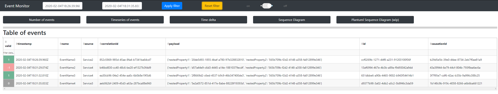
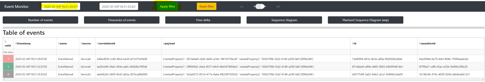

# event-dashboard
Using [Dash](https://dash.plot.ly) to visualize events. Events are expected to be stored in [Elasticsearch](https://www.elastic.co/guide/en/elasticsearch/reference/current/docker.html). 


## Motivation
Enable to see all send events at a glance, provide filtering and visualizations for the events.
Enhance data by adding information from other services, like a [Pact broker](https://docs.pact.io/getting_started/sharing_pacts).

## Idea
A consumer gets all Kafka events on a regular basis and writes them into elasticsearch.
On consuming the callbacks for updating the diagrams are called, for example "lastUpdate". The diagrams are build using timeseries between lastCleared and lastUpdate, as well es the consumer group id.

# Overview


## Getting started

### Setup elasticsearch

In order to run the application locally, you need have an Elasticsearch instance running. For development and to get started, it is recommended to use the single node dockerized instance, as described [here](https://www.elastic.co/guide/en/elasticsearch/reference/current/docker.html)
```
docker pull docker.elastic.co/elasticsearch/elasticsearch:7.5.2

docker run -p 9200:9200 -p 9300:9300 -e "discovery.type=single-node" docker.elastic.co/elasticsearch/elasticsearch:7.5.2
``` 

### Setup plantuml

[Plantuml](https://plantuml.com) is used to create sequence diagrams based on the events. Since the receiver of the event is not contained in the event, the information is added as target to the schema file.
In order to work properly please add plantuml.jar along app.py.

### Setup app

It is recommended (but not necessary) to use a [virtual environment](https://virtualenv.pypa.io/en/latest/userguide.html) virtual environment. 
Checkout the repository and install all required module using command

```
pip install -r requirements.txt
```

Afterwards start the app using 

```
python app.py
```

The dashboard is then available [here](http://127.0.0.1:18550/kebab/) following the rule 
```
http://<host>:<port>/<url_base_pathname>

# see line: app = dash.Dash(server=server, url_base_pathname='/kebab/', external_stylesheets=[dbc.themes.BOOTSTRAP])
```

In order to add some test data you can use the test in test_add_new_event.py.
Run
```
pytest -k test_add_new_event.py
```
which will add a new event to elasticsearch.

Afterwards you should see the event in the dashboard.

You can see all events which are available at elasticsearch.


You can also filter by timestamp using the input fields at the top



The diagrams/charts get visible when clicking on the according buttons, like it can be seen here:


## Schema validation
To validate the events jsonschema is used. An example schema file can be found in folder event_schemas. An updated schema definition can either be placed in the same folder or in can be posted using Rest. See folder
```
tests/e2e/test_post_schema.py
```
as reference. Using that api result in creating a new schema file with a timestamp. The app reads that file and stores its content in-memory, to speed up event validation.